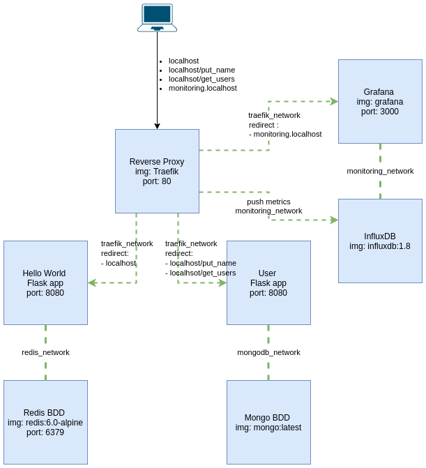

# Elective Docker

## Pour lancer le projet:

*   cloner le projet : `git clone https://github.com/BriceMichalski/SCHOOL_Docker_TP_Final.git && cd SCHOOL_Docker_TP_Final`
*   Lancer la commande : `docker-compose up -d`

## List des service:

*  Service Hello World avec compteur de visite 

   * accessible sur : `localhost`

*  Service User

   * Recuperer la liste des users: `curl -X GET localhost/get_users` ou depuis un navigateur sur `localhost/get_users`

   * Pousser un user : `curl -X POST localhost/put_name/$name`

*  Service de monitoring 

   * Accessible sur `monitoring.localhost`

## Pour générer du trafic aléatoirement:

*   Avoir curl d'installé
*   Avoir jq d'installé
*   Lancer la commande : `./random_traffic.sh`

Ce script injecte aleatoirement des utilisateurs en base depuis l'api de http://names.drycodes.com/

## Pour acceder à la configuration du reverse proxy :

*   Visualisation de la configuration du reverse proxy : `localhost:8080`

## Architecture: 

